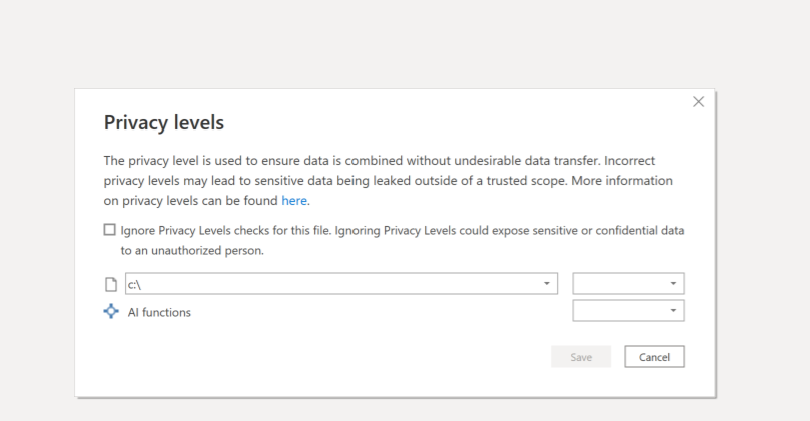
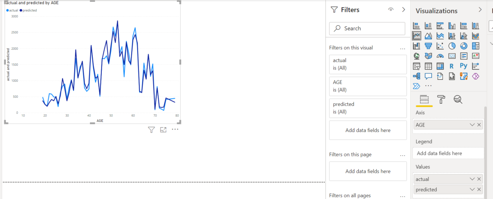

# Azure Machine Learning Integration Lab

This lab walks through Power BI Integration with Azure Machine Learning

**Note:** In order to do this lab, you will need to do the [prerequisite](https://github.com/lipinght/pbideployment/blob/main/AdvAnalytics/Prerequisite.md#aml-intergration-lab-prerequisite) first.

# Clone and run a notebook

1. Launch Jupyter once the compute instance is running, on the top right, click **new** and select Terminal to open a terminal, and ensure that the current path is the /users/your-user-name folder.


2. Enter the following command to clone a Git repository containing notebook we will use to your workspace:

```git
git clone https://github.com/lipinght/PBICookbook
```

3. When the command has completed, in the files tab in jupyter, click ↻ to refresh the view and verify that a new /users/your-user-name/PBICookbook folder has been created, browse to **/users/your-user-name/PBICookbook/AdvAnalytics**, Open **DiabetesRealTimeInference.ipynb**, run each code cell in turn.

**Note:** The last cell will do the deployment, the deployment will take 5-7 minutes. While waiting for deployment to complete, you can run [other Labs](https://github.com/lipinght/pbideployment/blob/main/AdvAnalytics/Labs.md). Once completed, the output will read **Succeeded
ACI service creation operation finished, operation "Succeeded"**

# Consume Model in Power BI

4. Open Power BI Desktop, click on **Get Data** and select **Web**


5. select **Basic**, In URL enter following text, click **OK**.

```txt
https://www4.stat.ncsu.edu/~boos/var.select/diabetes.tab.txt
```

6. Select **Anonymous** and click **Connect**


7. Select **Transform data** to open the Power Query Editor, select the **Azure Machine Learning** button in AI insights.


8. After signed in to your azure account, you will see a list of real time inference endpoints available to you, select **my-diabetes-model** which you deployed in the previous step, click **OK**.It triggers a warning on data privacy for both the data and the endpoint.In the next screen, select **Ignore Privacy Levels checks for this file > Save**.




9. The scoring will add an additional column named **AzureML.my-diabetes-model** The data that the service returns is a list.To get the predictions, select the double-headed arrow in the AzureML.my-diabetes-model column header > Expand to New Rows.


10. Follow these next steps to finish cleaning up your data model.

* Rename the **AzureML.my-diabetes-model** column to **predicted**: right click column header, select **rename**.
* Rename the **Y** column to **actual**: right click column header, select **rename**.
* Change the type of the **actual** column: right click column header, select **Change Type** > **Decimal Number**.
* Change the type of the **predicted** column: right click column header, select **Change Type** > **Decimal Number**.
* On the Home ribbon, select **Close & Apply**.

11. Build a visual to show the difference between actual and predicted.

* In the Visualizations pane, select a Line chart.
* With the line chart visual selected:
* Drag the **AGE** field to the Axis.
* Drag the **actual** field to Values.
* Drag the **predicted** field to Values.



12. You can then publish the report to Power BI Service and schedule a refresh for the dataset.