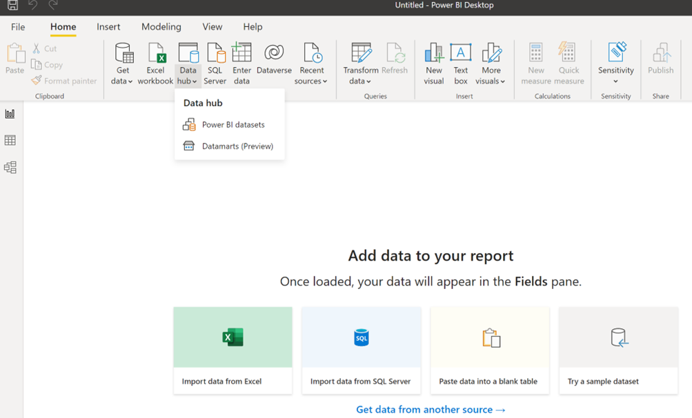
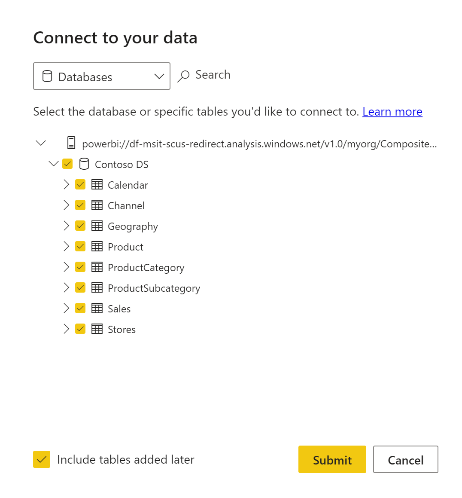
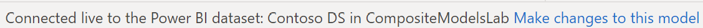
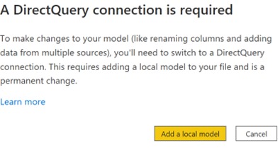
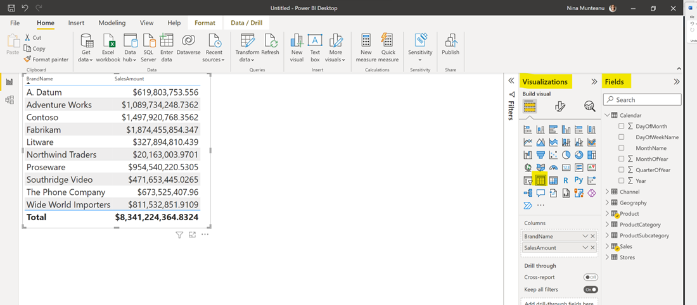
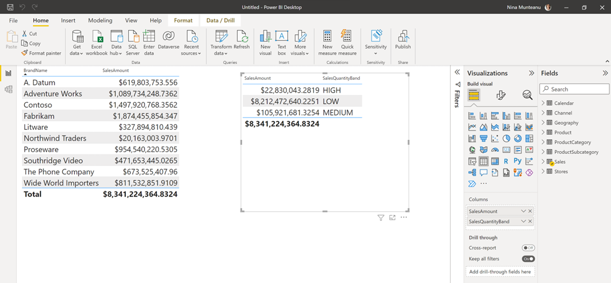

# DirectQuery for Power BI datasets Lab
This lab walks through how to connect with DirectQuery to a dataset published within Power BI Service.

**Note:** In order to do this lab, you will need access to premium or premium per user capacity. Do the [prerequisite](https://github.com/lipinght/pbideployment/blob/main/AdvAnalytics/Prerequisite.md#provision-workspace) before starting the lab

1. Since the functionality is currently in preview, you must first enable it. To do so, in Power BI Desktop go to **File** > **Options and settings** > **Options**, and in the **Preview features** section, select the **DirectQuery for Power BI datasets and Analysis Services** checkbox to enable this preview feature. You may need to restart Power BI Desktop for the change to take effect.

2. In Power BI Desktop, click on **Data Hub** and select **Power BI Datasets**

3. In the **Data Hub** window search for Contoso and select **Contoso DS** then click **Connect**

4. In **Connect to your data** window make sure Contoso DS is checked along with all tables

5. Once the model has loaded into Power Bi Desktop, go to **Fields** panel and explore the tables loaded

6. To see which connections are being used in your model, check the status bar in the bottom right corner of Power BI Desktop. If you're only connected to an Power BI dataset, you see a message like the following image:

7. Go to **Fields** panel, click on **Sales** table, on the **...** and try to add a new column by clicking on **New Column** button - notice that this is not possible in **Live** Mode

8. In Power BI Desktop click on **Home** > **Transform Data** > **Add a Local Model**. 

9. Selecting the button displays a dialog confirming addition of a local model. Select **Add a local model** to enable creating new columns or modifying the metadata for fields from the Contoso Power BI dataset:

10. In the next window click **Submit**

11. Close the Power Query Editor window

12. From the **Visualisations** panel selct the **Table** visual

13. From the **Fields** panel expand **Product** and select **BrandName**

14. From the **Fields** panel expand **Sales** and select **SalesAmount**

15. Go to **Fields** panel, click on **Sales** table, on the **...** and try to add a new column by clicking on **New Column** button - notice that this is now possible and that **New Column** option is available in the menu. Click on **New Column**

16. Copy and Paste the following DAX code in the calculation ribbon to add a new **SalesQuantityBand** calculated column: 

<mark>SalesQuantityBand = SWITCH(TRUE(), Sales[SalesQuantity] <= 100, "LOW", Sales[SalesQuantity] <= 500, "MEDIUM", "HIGH")</mark>

17. Create a new **Table** visual and in the **Fields** > **Sales** table select columns **SalesAmount** and **SalesQuantityBand**

