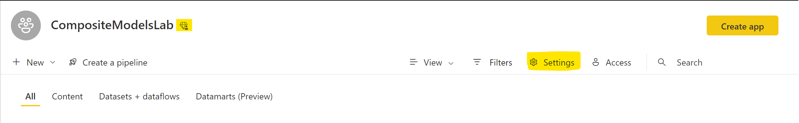

# Download latest version of Power BI Desktop

Download and install the [latest version](https://www.microsoft.com/en-gb/download/details.aspx?id=58494) of Power BI Desktop. 

# Provision Workspace

Some of the labs in this series require premium or premium per user workspace.

If you already have access to a premium or premium per user workspace in Power BI service, ignore this step. Otherwise, go to [powerbi.com](https://powerbi.microsoft.com/), sign in on top right, create a workspace

Name the workspace and then click **Save**. 

If you have a premium per user license, the workspace you created will be on prepmium per user capacity automatically, premium per user capacity is shown as a symbol with a diamond and a person

If you do not have premium per user license, click **Settings**

Click on **Premium**, and assign your workspace to a **Premium per capacity** that you have access to, click **Save**