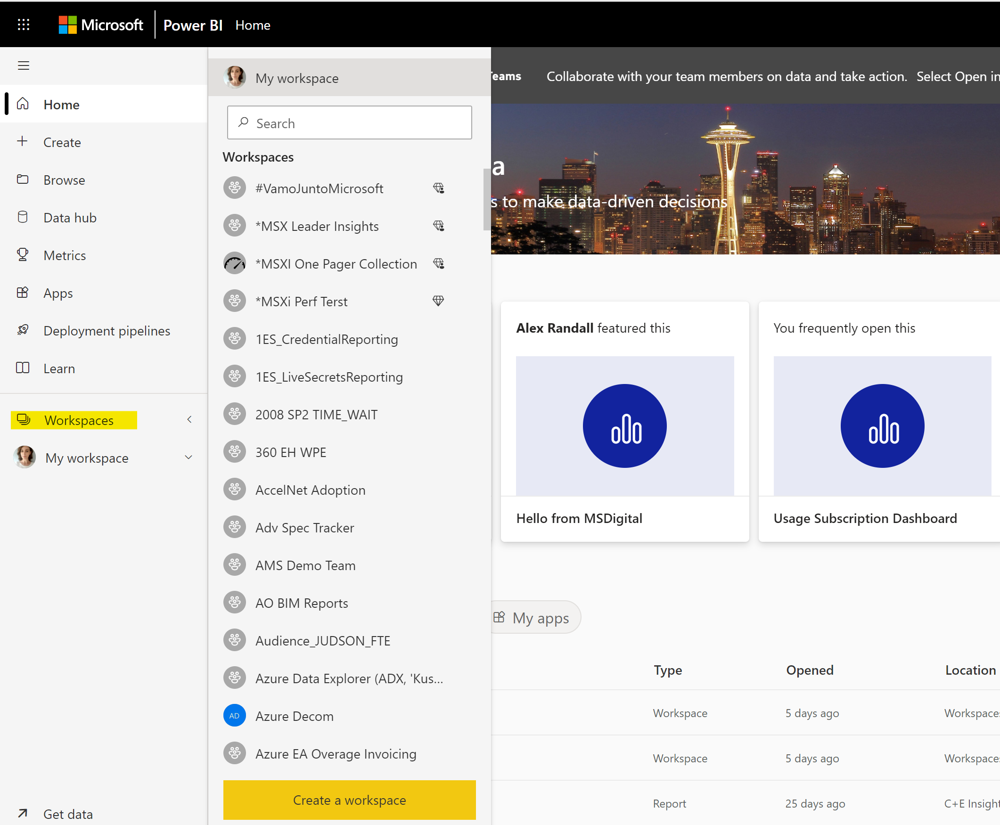

# Download latest version of Power BI Desktop

Download and install the [latest version](https://www.microsoft.com/en-gb/download/details.aspx?id=58494) of Power BI Desktop. 

# Provision Workspace

If you already have access to a workspace in Power BI service, ignore this step. Otherwise, go to [powerbi.com](https://powerbi.microsoft.com/), sign in on top right, create a workspace

Name the workspace and then click **Save**. 

