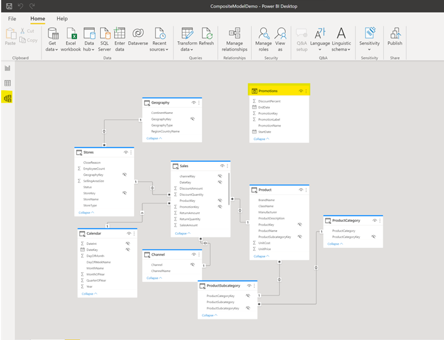
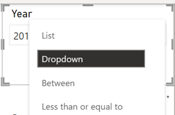
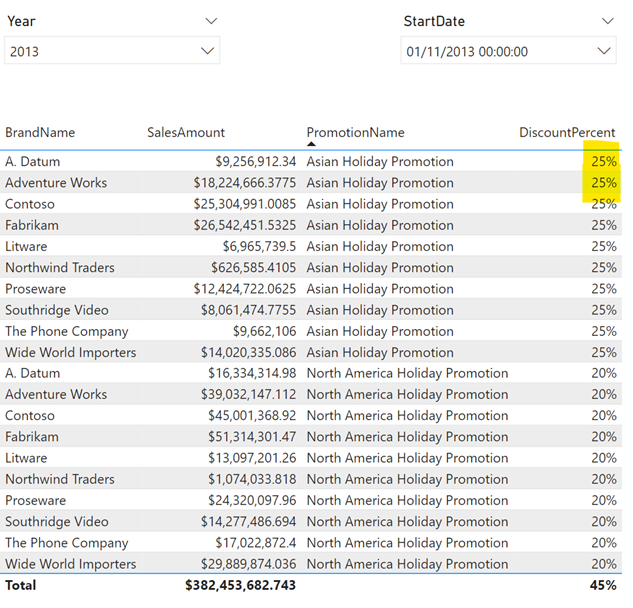

# Use Composite Model Lab
This lab walks through how to connect with DirectQuery to a dataset published to Power BI Service and how to enrich this model by including another data connection in Import mode.

**Note:** In order to do this lab, you will need access to premium or premium per user capacity. Do the [prerequisite](https://github.com/lipinght/pbideployment/blob/main/AdvAnalytics/Prerequisite.md#provision-workspace) before starting the lab
This lab requires completion of the **DirectQuery for Power BI datasets** lab.

1. Download locally on your computer the following Excel spreadsheet: **Promotions.xlxs**

2. In Power BI Desktop, open the .pbix file from lab **DirectQuery for Power BI datasets**

3. Click on **Get Data**, choose **Excel Workbook** and then navigate to the **Promotions.xlxs** spreadsheet you downloaded locally

4. Select the **Promotions** checkbox in the Navigator window and click **Load** button

5. A warning window about a potential security risk shows up, since now you are mixing local data with data in the cloud and queries will go back and forth, exchanging data. Click **OK**

6. Promotions data from the local spreadsheet is now loading into Power BI Desktop and will show up in the **Fields** panel

7. Navigate to the **Data** view and click on the **Promotions** table in the **Fields** panel. The new table contains the data that’s imported from Excel.

8. Navigate to **Relationships** view in Power BI Desktop, you can now see an additional table called **Promotions**, not related to any of the other tables in the model

9. We now need to relate the **Promotions** table to the other tables in the model. To create a relationship between the **Sales** table from the Contoso PBI dataset and the imported **Promotions** table, click on the **Manage Relationships** menu item, then click on **New…**

10. In the **Create relationship**  window select **Sales**. Automatically the window gets populated with sample Sales records and sample Pomotions records, with PromotionKey field highlighted in both tables.

11. Check **Cardinality** and make sure it is set to **Many to one(*:1)**. Click **OK**. Click **Close**

12. Click on **Promotions** table, right click **PromotionsKey** field and select **Hide in report view**

13. Navigate back to the **Report** view

14.	Create a new report page

15. From the **Visualisations** panel click on **Table** visual

16. From the **Fields** panel expand Product and select **BrandName**

17. From the **Fields** panel expand Sales and select **SalesAmount**

18.	From the **Fields** panel expand Promotions and select **PromotionName**

19. From the **Fields** panel expand Promotions and select **DiscountPercent**

20. Navigate to the **Data** view, click on the **DiscountPercentage** column, click on the Percentage button on the Menu ribbon then change the number of decimal places shown for this column to 0

21. Navigate to the **Report** view. Now the **DiscountPercent** values should be displayed as percentages

22. From the **Visualizations** panel add a **Slicer** visual

23. In the **Fields** panel expand Calendar and select Year to populate the slicer

24. Click on the Year slicer visual on the report and from the right upper corner, click on the arrow to select **Dropdown** option

25. From the **Visualizations** panel add a Slicer visual

26. In the **Fields** panel expand Promotions and select StartDate to populate the slicer

27. Click on the StartDate slicer visual on the report and from the right upper corner click on the arrow to select **Dropdown** option

28. Select 2013 in the **Year** slicer and 01/11/2013 in the **StartDate** one

29. In Power BI Desktop, save your changes then on the menu ribbon click **Publish**

30. Select a workspace to publish to (If you don’t have a workspace make sure you completed the Prerequisite steps) then click **OK**

# Add measures to a Composite Model

31. In the same Power BI Desktop .pbix file, create a new report page by right click-ing on the current page name and select **Duplicate Page**

32. Click on your table visual in the newly created page, and in the **Visualisations** panel under Columns, remove column BrandName

33. Click on your table visual in the newly created page, and in the **Fields** panel right click on Sales, then select **New Measure**

34. Copy and Paste the following DAX code for the new measure **NumberOfProducts**, then hit **Enter**
 
<mark>NumberOfProducts = COUNTROWS ('Product')</mark>

35. Click on your table visual in the newly created page, and in the **Fields** panel > **Sales**, select **NumberOfProducts**

36. In Power BI Desktop, create a new report page by right click-ing on the current page name and select **Duplicate Page**

37. Click on your table visual in the newly created page, and in the **Visualisations** panel under Columns, remove columns SalesAmount, NumberOfProducts

38. Click on your table visual in the newly created page, and in the **Fields** panel right click on Sales, then select **New Measure**

39. Copy and Paste the following DAX code for the new measure **SumOfSales**, then hit **Enter**

<mark>SumOfSales = SUM(Sales[SalesAmount])</mark>

40. Click on your table visual in the newly created page, and in the **Fields** panel > **Sales**, select **NumberOfProducts**

41. Click on your table visual in the newly created page, and in the **Fields** panel right click on Sales, then select **New Measure**

42. Copy and Paste the following DAX code for the new measure **YTDSumOfSales**, then hit **Enter** 

<mark>YTDSumOfSales = TOTALYTD([SumOfSales],'Calendar'[DateKey])</mark>

43. Click on your table visual in the newly created page, and in the **Fields** panel > **Sales**, select **YTDSumOfSales**

44. On the menu ribbon, **Measure** tools, format YTDSumOfSales measure by adding comma as a thousands separator and add a currency symbol

