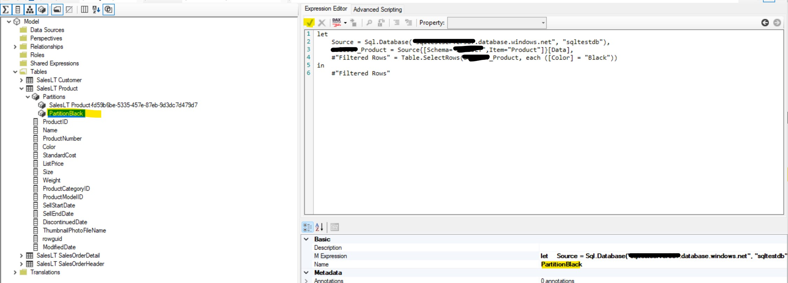

## Part 1 Dataset Setup
Step 1. Provision a SQL Database with a sample adventure works data, see [here](https://docs.microsoft.com/en-us/sql/samples/adventureworks-install-configure?view=sql-server-ver16&tabs=ssms#deploy-to-azure-sql-database) for instruction.

Step 2.  Open Power BI Desktop, click on **get data**, connect to the newly created SQL database and load in below tables using import mode.

 * Customer
 * Product
 * SalesOrderDetail
 * SalesOrderHeader

Step 3. publish dataset to a premium workspace with the name **adventureworks**, update data source credential in power bi service.

Step 4. Connect to the published dataset using XMLA endpoint and create two partitions in the **product** Table

* Name PartitionBlack, M code example 
```

let
    Source = Sql.Database("[yourservername].database.windows.net", "[yourdatabasename]"),
    SalesLT_Product = Source{[Schema="SalesLT",Item="Product"]}[Data],
    #"Filtered Rows" = Table.SelectRows(SalesLT_Product, each ([Color] = "Black"))
in
    #"Filtered Rows"
```

* Name PartitionRed, M code example
 
```

let
    Source = Sql.Database("[yourservername].database.windows.net", "[yourdatabasename]"),
    SalesLT_Product = Source{[Schema="SalesLT",Item="Product"]}[Data],
    #"Filtered Rows" = Table.SelectRows(SalesLT_Product, each ([Color] = "Red"))
in
    #"Filtered Rows"

```
* Amend the default parition to be

```
let
    Source = Sql.Database("[yourservername].database.windows.net", "[yourdatabasename]"),
    SalesLT_Product = Source{[Schema="SalesLT",Item="Product"]}[Data],
    #"Filtered Rows" = Table.SelectRows(SalesLT_Product, each ([Color] <> "Black" and [Color] <> "Red"))
in
    #"Filtered Rows"

```
Below is a Tabular Editor Example, you can also create partitions using [SSMS](https://docs.microsoft.com/en-us/analysis-services/tabular-models/create-and-manage-tabular-model-partitions?view=sql-analysis-services-2022#to-create-a-new-partition-1) or [Visual Studio](https://docs.microsoft.com/en-us/analysis-services/tutorial-tabular-1400/as-lesson-10-create-partitions?view=sql-analysis-services-2022)

1. Open Tablular Editor, and choose **Open from DB** in **File**


2. Populate your xmla endpoint in **server** and choose the dataset **adventureworks**


3. Expand folder **Tables**, right click on the **product** table, and click **Create New** and choose **partition(power query)**


4. Expand **Partitions** under **product** table, choose **New M Partition**, change the name to "PartitionBlack", put below m code in expression editor (replacing your server and database name), click the :heavy_check_mark: sign to add the expression to partition

```

let
    Source = Sql.Database("[yourservername].database.windows.net", "[yourdatabasename]"),
    SalesLT_Product = Source{[Schema="SalesLT",Item="Product"]}[Data],
    #"Filtered Rows" = Table.SelectRows(SalesLT_Product, each ([Color] = "Black"))
in
    #"Filtered Rows"
```



5. Right click on **PartitionBlack** and click on **duplicate PartitionBlack**


6. Change the name of the partition to **PartitionRed** and put below m code in expression editor (replacing your server and database name),click the :heavy_check_mark: sign to add the expression to partition

```

let
    Source = Sql.Database("[yourservername].database.windows.net", "[yourdatabasename]"),
    SalesLT_Product = Source{[Schema="SalesLT",Item="Product"]}[Data],
    #"Filtered Rows" = Table.SelectRows(SalesLT_Product, each ([Color] = "Red"))
in
    #"Filtered Rows"

```


7. Click on the default partition in the **product** table, and put above m code in expression editor (replacing your server and database name),click the :heavy_check_mark: sign to add the expression to partition

```
let
    Source = Sql.Database("[yourservername].database.windows.net", "[yourdatabasename]"),
    SalesLT_Product = Source{[Schema="SalesLT",Item="Product"]}[Data],
    #"Filtered Rows" = Table.SelectRows(SalesLT_Product, each ([Color] <> "Black" and [Color] <> "Red"))
in
    #"Filtered Rows"

```


Step 5. Deploy the updated dataset to a premium workspace, below is Tabular Editor Example, you can also use other tools such as [Visual Studio](https://docs.microsoft.com/en-us/analysis-services/tutorial-tabular-1200/lesson-13-deploy?view=sql-analysis-services-2022)

1. Click on **Model** and **Deploy**

2. Click through and make sure **Deploy Table Partitions** is checked


## Part 2 Infrastructure Setup

Follow the instruction [here](https://github.com/mariuspc/pbi-xmla-refresh) for steps 1-9